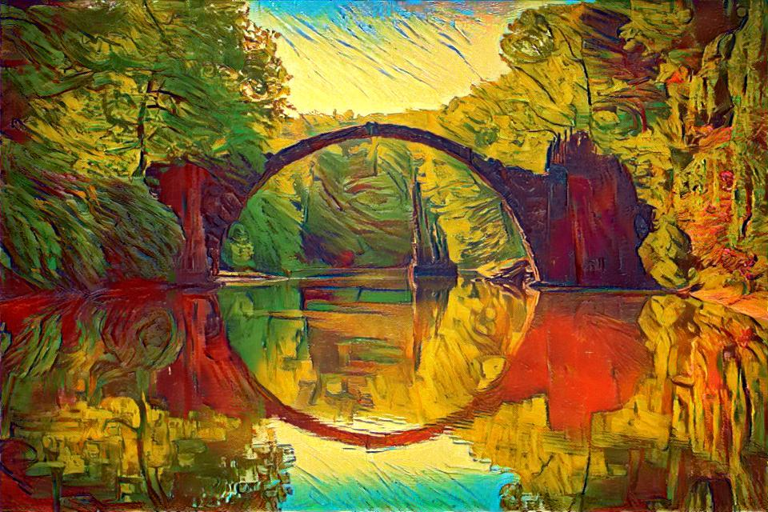
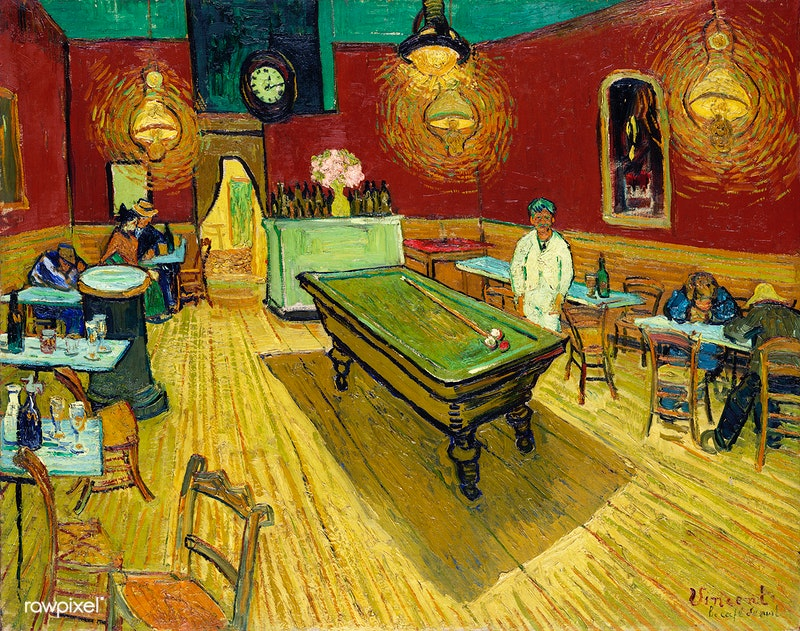
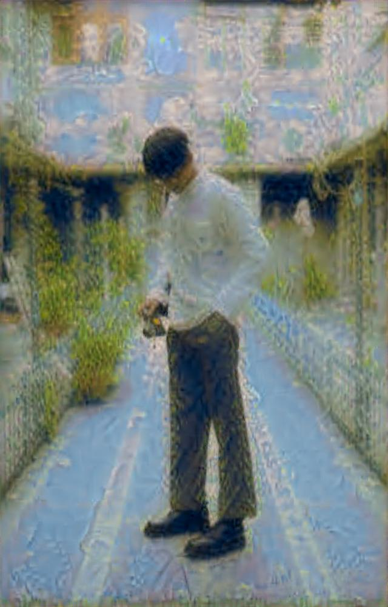
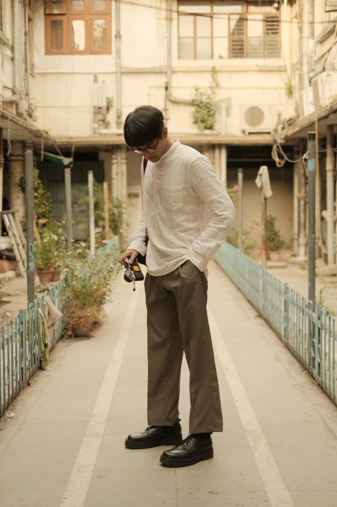
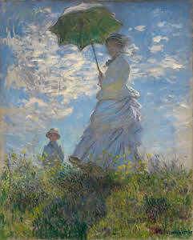

# Neural Style Transfer Project

This repository develops tools that perform neural style transfer on digital contents, one for images and the other for videos. The project utilizes image style transfer techniques to transfer the style of a given image onto another image or a video, which is an implementation of the original neural style transfer [paper](https://www.cv-foundation.org/openaccess/content_cvpr_2016/papers/Gatys_Image_Style_Transfer_CVPR_2016_paper.pdf) by Gatys et al..

## Table of Contents

- [Neural Style Transfer Project](#neural-style-transfer-project)
  - [Table of Contents](#table-of-contents)
  - [Introduction](#introduction)
  - [Installation](#installation)
  - [Usage](#usage)
    - [Image Style Transfer](#image-style-transfer)
    - [Video Style Transfer](#video-style-transfer)
  - [Project Structure](#project-structure)
  - [Example](#example)
  - [Contributing](#contributing)
  - [License](#license)

## Introduction

Neural style transfer on images begins with using a pre-trained deep neural network, known as VGG19, to extract style and content information from the input images. By preserving the content features from the content image and the style features from the style image, a new image is generated that exhibits the content of the content image in the style of the style image in a visually appealing way. This process leverages the power of convolutional neural networks and iterative optimization algorithms to achieve impressive artistic transformations.

Here are some examples of style-transferred images along with their original content and style images:

<p align="center">
    
</p>
<p align="center">
    
    
</p>

----------------

<p align="center">
    
</p>
<p align="center">
    
    
</p>


Furthermore, we extend the neural style transfer technique to videos.Built on top of neural style transfer for images, video style transfer involves splitting the video into frames, applying image style transfer on each frame, and subsequently synthesizing the transferred frames to reconstruct the video so that it has a visually pleasing artistic transformation.


## Installation
To run the neural style transfer project, follow these steps:

1. Clone the repository:
   ```
   git clone https://github.com/your-username/neural-style-transfer.git
   ```
2. Navigate to the project directory:
   ```
   cd neural-style-transfer
   ```
3. Install the required dependencies:
   ```
   pip install -r requirements.txt
   ```

**Note: GPU Acceleration**

For optimal performance, it is recommended to run the program on a system with GPU acceleration. Make sure to have the necessary GPU drivers and libraries installed. This will significantly speed up the style transfer process.

## Usage
### Image Style Transfer
To perform style transfer on an image, use the `image_style_transfer.py` program. Run the following command:
```
python image_style_transfer.py --content <path_to_content_image> --style <path_to_style_image> --output <output_path>
```
Replace `<path_to_content_image>` with the path to the input content image, `<path_to_style_image>` with the path to the input style image, and `<output_path>` with the desired output path for the transferred image.

### Video Style Transfer
To apply style transfer on a video, utilize the `video_style_transfer.py` program. Execute the following command:
```
python video_style_transfer.py --video <path_to_video> --style <path_to_style_image> --output <output_path>
```
Replace `<path_to_video>` with the path to the input video, `<path_to_style_image>` with the path to the style image, and `<output_path>` with the desired output path for the transferred video.

## Project Structure
The repository is organized as follows:

- `process_image.py`: This module contains functions to load an image with a desired size.
- `train_model.py`: This module defines the neural network architecture and the training process.
- `image_style_transfer.py`: This program allows the user to transfer the style of an image onto another image.
- `video_style_transfer.py`: This program enables the user to transfer the style of an image onto a video.
- `example_images/`: This directory contains example input images for style transfer.
- `example_videos/`: This directory contains example input videos for style transfer.

## Example
Here is an example of performing style transfer on an image using the provided scripts:

```
python image_style_transfer.py --content example_images/content.jpg --style example_images/style.jpg --output output.jpg
```

This command transfers the style of `style.jpg` onto `content.jpg` and saves the result as `output.jpg`.

## Contributing
Contributions to this project are welcome. Feel free to submit issues and pull requests.

## License
This project is licensed under the [MIT License](LICENSE).